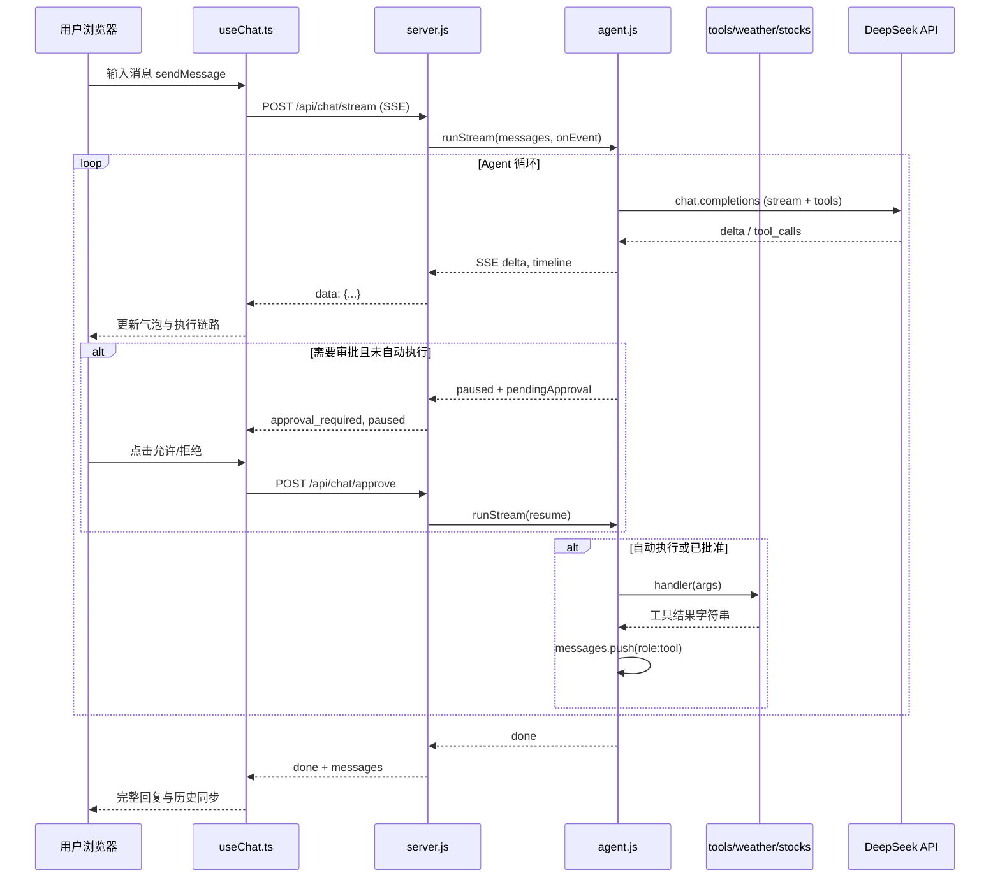

# AI Agent Studio

基于 **DeepSeek**（OpenAI 兼容 API）的本地 Agent 练手项目：多轮对话、工具调用（天气 / 股票 / 时间 / 计算）、流式输出、工具执行前人工审批。

适合用来学习：**Tool Calling 循环、messages 协议、SSE、Prompt 工程**。

---

## 环境要求

- Node.js 18+（推荐 18 或 20）
- npm
- DeepSeek API Key（[https://platform.deepseek.com](https://platform.deepseek.com)）

---

## 快速开始

### 1. 安装依赖

```bash
# 项目根目录
npm install

# 前端（React + Vite）
cd client && npm install && cd ..
```

### 2. 配置环境变量

复制示例并填入 Key：

```bash
cp .env.example .env
```

编辑 `.env`：

```env
DEEPSEEK_API_KEY=你的密钥
# 可选
# DEEPSEEK_BASE_URL=https://api.deepseek.com/v1
# DEEPSEEK_MODEL=deepseek-chat
# PORT=3000
```

> API Key **只放在服务端** `.env`，不要写进前端代码。

### 3. 启动

| 命令 | 说明 |
|------|------|
| `npm run dev:hot` | **推荐开发**：后端 + 前端热更新（Vite 5173 需代理或分别访问，见下） |
| `npm run dev` | 先构建前端到 `dist/`，再启动 `server.js` |
| `npm run ui` | 仅启动服务（需已有 `dist/` 或 `public/`） |
| `node agent.js "上海天气"` | **CLI**，不走浏览器，适合调试 Agent |

开发时通常：

```bash
npm run dev:hot
```

- 后端：http://localhost:3000（若端口占用会自动 3001…）
- 前端开发服：http://localhost:5173（Vite 会把 `/api` 代理到后端，见 `client/vite.config.ts`）

浏览器打开 **http://localhost:5173** 或构建后 **http://localhost:3000**。

### 4. 验证

- 侧边栏显示「在线 · 流式就绪」
- 试：「上海天气怎么样？」「查询贵州茅台股票」
- 关闭「自动执行工具」后，应出现「允许执行 / 拒绝」

---

## 项目结构

```
ai/
├── agent.js          # Agent 核心：工具循环、流式、审批暂停
├── tools.js          # 注册默认 4 个工具
├── prompts.js        # 系统提示词
├── server.js         # Express + SSE API + 静态资源
├── weather.js        # 天气工具（Open-Meteo）
├── stocks.js         # 股票工具（东方财富）
├── client/           # React 前端
│   └── src/
│       ├── hooks/useChat.ts    # 聊天状态 + SSE
│       ├── api/sse.ts          # 解析 SSE 流
│       ├── components/         # UI 组件
│       └── types.ts            # 类型定义
├── dist/             # 前端构建产物（npm run build:client）
├── backup/           # 旧版静态 UI 备份
├── .env              # 本地密钥（勿提交）
└── README.md         # 本文件
```

---

## 端到端流程

### 总览图



### 一次提问的详细步骤

1. **前端** `sendMessage` 把用户话 append 到 UI，并 `POST /api/chat/stream`，body 含：
   - `message`：本条用户输入
   - `messages`：`chatHistory`（上一轮结束时的 OpenAI 格式历史）
   - `systemPrompt`：侧边栏系统提示词
   - `autoApproveTools`：是否跳过工具审批

2. **server.js** `prepareChatBody` 拼出完整 `chatMessages`，调用 `agent.runStream`。

3. **agent.js** 循环（最多 `maxToolRounds` 轮）：
   - 流式请求模型（带 `tools`）
   - 若无 `tool_calls` → 结束，返回最终文本
   - 若有 `tool_calls`：
     - 若需审批 → `paused: true`，server 存 `pendingSessions`
     - 否则 → `_executeToolCalls` → 每个工具 `handler` 执行 → `role: tool` 写入 `messages` → 下一轮

4. **SSE 事件** 推送到前端，`useChat.handleStreamEvent` 更新文字与 Timeline。

5. **`done`** 时前端用服务端返回的 `messages` 更新 `chatHistory`，供下一轮多轮上下文。

### 消息角色（OpenAI 格式）

| role | 说明 |
|------|------|
| `system` | 系统提示词（工具列表与规则） |
| `user` | 用户输入 |
| `assistant` | 模型回复，可能含 `tool_calls` |
| `tool` | 工具执行结果，需带 `tool_call_id` |

---

## API 说明

| 方法 | 路径 | 说明 |
|------|------|------|
| GET | `/api/config` | 模型、Key 状态、工具列表、默认 prompt |
| POST | `/api/chat/stream` | **主接口**，SSE 流式对话 |
| POST | `/api/chat/approve` | 工具审批后继续，body: `{ sessionId, approved }` |
| POST | `/api/chat` | 非流式一次性（备用） |

### SSE 事件类型

| type | 含义 |
|------|------|
| `delta` | 助手回复增量文字 |
| `timeline` | 执行链路步骤更新 |
| `approval_required` | 需用户确认工具 |
| `paused` | 流暂停，带 `sessionId` 与当前 `messages` |
| `done` | 完成，含 `reply`、`messages`、`durationMs` |
| `error` | 错误信息 |

---

## 核心文件阅读顺序（学习用）

1. `prompts.js` — 模型行为规则  
2. `tools.js` — 工具如何注册  
3. `agent.js` — **重点**：`run` / `runStream` / `_executeToolCalls`  
4. `server.js` — HTTP 与审批会话  
5. `weather.js` / `stocks.js` — 真实工具实现  
6. `client/src/hooks/useChat.ts` + `api/sse.ts` — 前端如何接流  

各文件顶部均有中文注释，说明职责与关键点。

---

## 内置工具

| 工具名 | 说明 | 实现 |
|--------|------|------|
| `getWeather` | 城市实时天气 | `weather.js` → Open-Meteo |
| `getStockQuote` | A 股 / 美股 / 港股行情 | `stocks.js` → 东方财富 |
| `getCurrentTime` | 时区时间 | `tools.js` 内联 |
| `calculator` | 四则运算表达式 | `tools.js` 内联 |

### 如何新增工具

在 `tools.js` 的 `createDefaultAgent` 中增加一段 `agent.registerTool(...)`，并在 `prompts.js` 里写明何时必须调用。

---

## 常见问题

**侧边栏显示未配置 API Key**  
检查项目根目录 `.env` 是否有 `DEEPSEEK_API_KEY`，修改后需**重启** `node server.js`。

**改了后端代码不生效**  
重启 Node 服务；前端改 React 用 `dev:hot` 可热更新。

**端口被占用**  
服务会自动尝试 3001、3002…；或 `netstat -ano | findstr :3000` 结束占用进程。

**模型不调股票工具**  
检查 `prompts.js` 与工具 `description`；侧边栏系统提示词是否被改弱。

**浏览器仍显示旧 UI**  
`cd client && npm run build` 后重启服务，或 Ctrl+F5 强刷。

---

## 脚本一览

```json
"start": "node agent.js",
"ui": "node server.js",
"build:client": "npm run build --prefix client",
"dev": "npm run build:client && node server.js",
"dev:hot": "concurrently server + client/vite"
```

---

## 许可证

ISC（见 `package.json`）
